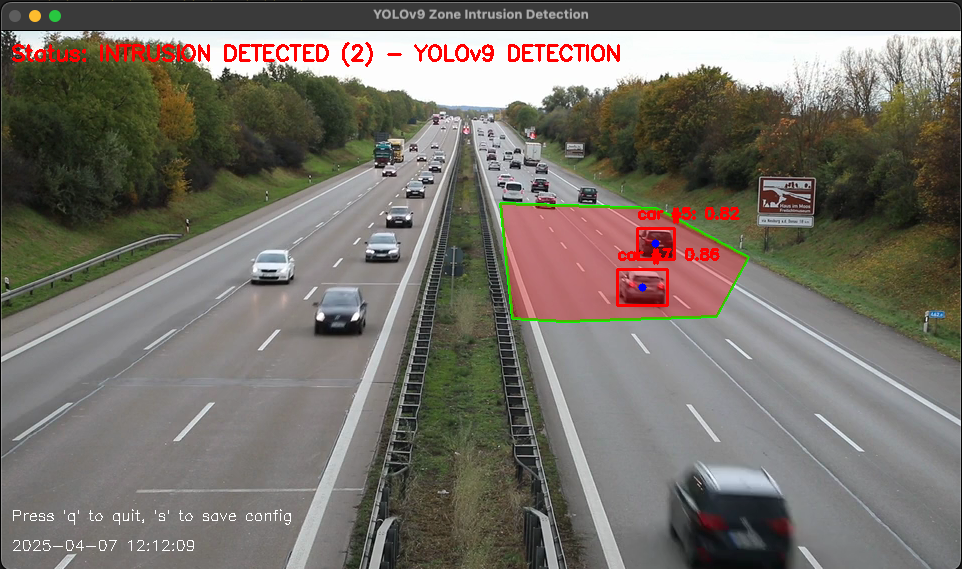
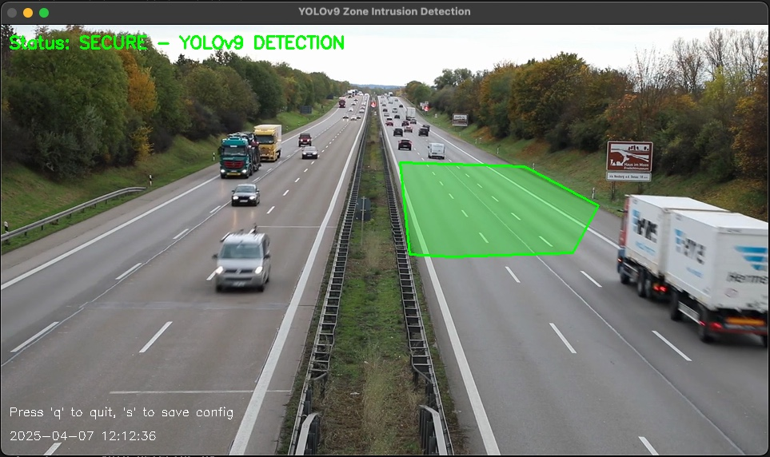

# YOLOv9 Zone Intrusion Detection

This branch provides a simplified version of the motion detection system that uses only YOLOv9 for object detection, without motion detection fallback.




## Features

- YOLOv9 object detection with zone intrusion alerts
- Object tracking with SimpleTracker
- Zone definition for monitoring specific areas
- Intrusion logging and alert system
- CSV and YAML export of detection data
- Screenshots of intrusion events

## Project Structure

```
motion_detection/
├── detect.py             # Main entry point
├── requirements.txt      # Project dependencies
├── lib/                  # Module library
│   ├── core/             # Core functionality
│   │   ├── intrusion_detector.py
│   │   └── zone_manager.py
│   ├── detectors/        # Detection algorithms
│   │   └── yolo_detector.py
│   ├── trackers/         # Object tracking
│   │   └── simple_tracker.py
│   ├── ui/               # Visualization
│   │   └── visualizer.py
│   └── utils/            # Utilities
│       ├── config.py
│       └── logger.py
├── models/               # YOLO model files
├── logs/                 # Application logs
└── intrusions/           # Saved intrusion images
```

## Installation

1. Clone the repository

   ```
   git clone https://github.com/yourusername/zone-intrusion-detection.git
   cd zone-intrusion-detection
   ```

2. Set up a Python virtual environment (recommended)

   ```
   python -m venv venv
   source venv/bin/activate  # On Windows: venv\Scripts\activate
   ```

3. Install dependencies

   ```
   pip install -r requirements.txt
   ```

## Requirements

See requirements.txt for dependencies.

## Usage

```bash
python detect.py --source 0 --model models/yolov9-s-converted.pt --conf 0.3
```

### Command Line Arguments

- `--source` - Video source (0 for webcam, or video file path)
- `--model` - Path to YOLOv9 model file
- `--conf` - Confidence threshold (0-1)
- `--config` - Path to optional configuration file

## Controls

- Press 'q' to quit
- Press 's' to save zone configuration

## Supported Models

This branch supports YOLOv9 models included in the repository:

- yolov9-s-converted.pt (default)
- yolov9-m-converted.pt
- yolov9-t-converted.pt

## Zone Definition

When you first run the application (or if no zone is defined):

1. You'll enter zone definition mode
2. Use left-clicks to place points defining your restricted zone
3. Right-click to complete the zone definition
4. Press `q` to save and continue

## Contributing

Contributions are welcome! Please follow these steps:

1. Fork the repository
2. Create a feature branch (`git checkout -b feature/amazing-feature`)
3. Make your changes
4. Commit your changes (`git commit -m 'Add some amazing feature'`)
5. Push to the branch (`git push origin feature/amazing-feature`)
6. Open a Pull Request
