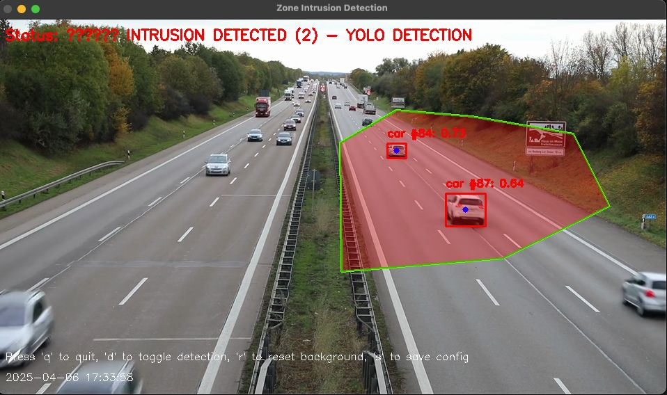
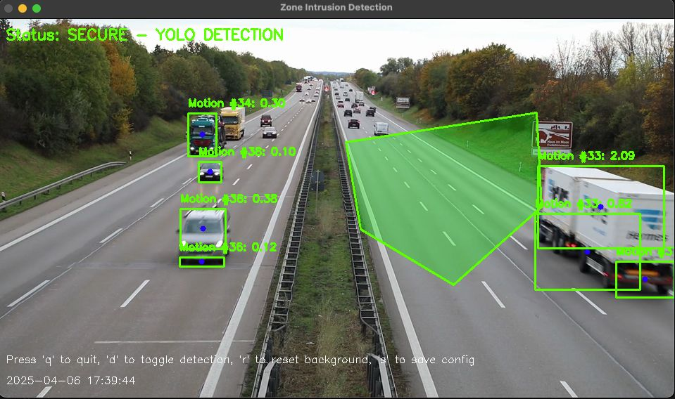

# YOLOv11 Zone Intrusion Detection System

A computer vision-based intrusion detection system that uses YOLOv11 object detection and implements zone-based alerting for security monitoring.




## Features

- **Region of Interest (ROI) Detection**: Optimized object detection that only processes within user-defined zones
- **Multiple Detection Methods**: YOLOv11 object detection with motion detection fallback
- **Real-time Tracking**: Tracks objects across video frames with unique IDs
- **Zone-based Intrusion Alerts**: Define restricted zones and get alerts when objects enter
- **Logging & Reporting**: CSV and YAML logging of intrusion events with timestamps
- **Automatic Screenshots**: Captures images when intrusions are detected
- **Interactive UI**: Real-time visualization with status information

## Project Structure

```
motion_detection/
├── detect.py             # Main entry point
├── requirements.txt      # Project dependencies
├── lib/                  # Module library
│   ├── core/             # Core functionality
│   │   ├── intrusion_detector.py
│   │   └── zone_manager.py
│   ├── detectors/        # Detection algorithms
│   │   ├── yolo_detector.py
│   │   └── motion_detector.py
│   ├── trackers/         # Object tracking
│   │   └── simple_tracker.py
│   ├── ui/               # Visualization
│   │   └── visualizer.py
│   └── utils/            # Utilities
│       ├── config.py
│       └── logger.py
├── models/               # YOLO model files
├── logs/                 # Application logs
└── intrusions/           # Saved intrusion images
```

## Installation

1. Clone the repository

   ```
   git clone git@github.com:zg0ul/motion-detection.git
   cd motion-detection
   ```

2. Set up a Python virtual environment (recommended)

   ```
   python -m venv venv
   source venv/bin/activate  # On Windows: venv\Scripts\activate
   ```

3. Install dependencies

   ```
   pip install -r requirements.txt
   ```

## Requirements

Main dependencies include:

- OpenCV (cv2)
- Ultralytics (YOLO)
- NumPy
- Shapely (for polygon operations)
- PyYAML (for configuration)

## Usage

### Basic Usage

Run the detector with default settings (using webcam):

```
python detect.py
```

### Command Line Options

```
python detect.py --source <VIDEO_SOURCE> --config <CONFIG_PATH> --model <MODEL_PATH>
```

- `--source`: Video source (0 for webcam, or path to video file)
- `--config`: Path to configuration file (optional)
- `--model`: Path to YOLOv11 model file (default: models/yolo11n.pt)

### Interactive Controls

During operation, the following keyboard controls are available:

- `q` or `ESC`: Quit the application
- `d`: Toggle between YOLO detection and motion detection
- `r`: Reset background model (for motion detection)
- `s`: Save current configuration to file

## Zone Definition

When you first run the application (or if no zone is defined):

1. You'll enter zone definition mode
2. Use left-clicks to place points defining your restricted zone
3. Right-click to complete the zone definition
4. Press `q` to save and continue

## Contributing

Contributions are welcome! Please follow these steps:

1. Fork the repository
2. Create a feature branch (`git checkout -b feature/amazing-feature`)
3. Make your changes
4. Commit your changes (`git commit -m 'Add some amazing feature'`)
5. Push to the branch (`git push origin feature/amazing-feature`)
6. Open a Pull Request
